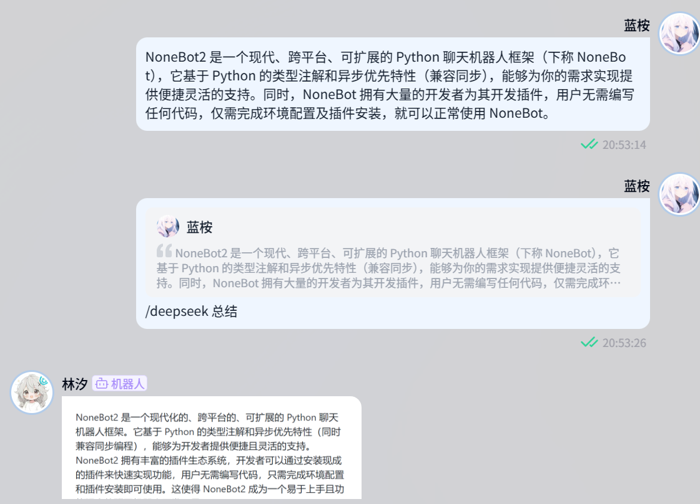

<!-- markdownlint-disable MD033 MD036 MD041 MD045 -->
<div align="center">
  <a href="https://v2.nonebot.dev/store">
    
  </a>
</div>

<div align="center">

# NoneBot-Plugin-DeepSeek

_✨ NoneBot DeepSeek 插件 ✨_

<a href="">
  
</a>

<a href="https://pdm.fming.dev">
  
</a>
<a href="https://github.com/nonebot/plugin-alconna">
  
</a>

<br/>

<a href="https://registry.nonebot.dev/plugin/nonebot-plugin-deepseek:nonebot_plugin_deepseek">
  
</a>
<a href="https://registry.nonebot.dev/plugin/nonebot-plugin-deepseek:nonebot_plugin_deepseek">
  
</a>

<br />
<a href="#-效果图">
  <strong>📸 演示与预览</strong>
</a>
&nbsp;&nbsp;|&nbsp;&nbsp;
<a href="#-安装">
  <strong>📦️ 下载插件</strong>
</a>
&nbsp;&nbsp;|&nbsp;&nbsp;
<a href="https://qm.qq.com/q/Vuipof2zug" target="__blank">
  <strong>💬 加入交流群</strong>
</a>

</div>

## 📖 介绍

NoneBot DeepSeek 插件。接入 DeepSeek 模型，提供智能对话与问答功能

Wiki: 👉 [传送门](https://github.com/KomoriDev/nonebot-plugin-deepseek/wiki)

> [!IMPORTANT]
> **收藏项目**，你将从 GitHub 上无延迟地接收所有发布通知～⭐️


<details>
  <summary><kbd>Star History</kbd></summary>
  <picture>
    <source media="(prefers-color-scheme: dark)" srcset="https://api.star-history.com/svg?repos=KomoriDev/nonebot-plugin-deepseek&theme=dark&type=Date" />
    
  </picture>
</details>

## 💿 安装

以下提到的方法任选 **其一** 即可

> [!TIP]
> 想要启用 Markdown 转图片功能，需安装 `nonebot-plugin-deepseek[image]`

<details open>
<summary>[推荐] 使用 nb-cli 安装</summary>
在 Bot 的根目录下打开命令行, 输入以下指令即可安装

```shell
nb plugin install nonebot-plugin-deepseek
```

</details>
<details>
<summary>使用包管理器安装</summary>

```shell
pip install nonebot-plugin-deepseek
# or, use poetry
poetry add nonebot-plugin-deepseek
# or, use pdm
pdm add nonebot-plugin-deepseek
```

打开 NoneBot 项目根目录下的配置文件, 在 `[plugin]` 部分追加写入

```toml
plugins = ["nonebot_plugin_deepseek"]
```

</details>

## ⚙️ 配置

在项目的配置文件中添加下表中配置

> [!note]
> `api_key` 请从 [DeepSeek 开放平台](https://platform.deepseek.com/) 获取  
> `enable_models` 为 [`CustomModel`](https://github.com/KomoriDev/nonebot-plugin-deepseek/blob/ee9f0b0f0568eedb3eb87423e6c1bf271787ab76/nonebot_plugin_deepseek/config.py#L34) 结构的字典，若无接入本地模型的需要则无需修改  
> 若要接入本地模型，请参见：👉 [Wiki - 接入本地模型](https://github.com/KomoriDev/nonebot-plugin-deepseek/wiki/本地模型)  

|           配置项             |必填|                            默认值                            |                  说明                  |
|:---------------------------: |:--:|                 :---------------------------:                |             :-----------:             |
|      deepseek__api_key       | 是 |                              无                              |                API Key                |
|   deepseek__enable_models    | 否 |[{ "name": "deepseek-chat" }, { "name": "deepseek-reasoner" }]|启用的模型 [配置说明](https://github.com/KomoriDev/nonebot-plugin-deepseek/wiki/%E9%85%8D%E7%BD%AE#enable_models-%E9%85%8D%E7%BD%AE%E8%AF%B4%E6%98%8E)|
|       deepseek__prompt       | 否 |                              无                              |                模型预设                |
|       deepseek__stream       | 否 |                             False                            |            是否启用流式传输            |
|       deepseek__timeout      | 否 |            {"api_request": 100, "user_input": 60}            |                超时设定                |
|     deepseek__md_to_pic      | 否 |                             False                            |        是否启用 Markdown 转图片        |
|deepseek__enable_send_thinking| 否 |                             False                            |             是否发送思维链             |

## 🎉 使用

> [!note]
> 请检查你的 `COMMAND_START` 以及上述配置项。这里默认使用 `/`

### 帮助

```bash
deepseek --help
         --balance

         [...content] 
           --use-model [model]
           --with-context
           --render | -r

         model
           --list | -l
           --set-default [model]
           --render-markdown ['enable' | 'disable' | 'on' | 'off']
```

### 问答

```bash
/deepseek [内容]
```

快捷命令：`/ds [内容]` 或回复文本消息

### 多轮对话

```bash
/deepseek --with-context [内容]
```

快捷指令：`/ds --with-context [内容]` `/多轮对话`

### 深度思考

```bash
/deepseek [内容] --use-model deepseek-reasoner
```

快捷指令：`/深度思考 [内容]`

### 余额

> 权限：SUPERUSER

```bash
/deepseek --balance
```

快捷指令：`/ds --balance` `/余额`

### 设置

> 权限：`设置默认模型` 指令仅 SUPERUSER 可用

```bash
# 查看支持的模型列表
/deepseek model -l|--list
# 设置默认模型
/deepseek model --set-default [模型名]
# 设置 Markdown 转图片
/deepseek model --render-markdown ['enable' | 'disable' | 'on' | 'off']
```

快捷指令：`/模型列表` `/设置默认模型 [模型名]`

### 自定义快捷指令

> 该特性依赖于 [Alconna 快捷指令](https://nonebot.dev/docs/2.3.3/best-practice/alconna/command#command%E7%9A%84%E4%BD%BF%E7%94%A8)。自定义指令不带 `COMMAND_START`，若有必要需手动填写

```bash
# 增加
/deepseek --shortcut <自定义指令> /deepseek
# 删除
/deepseek --shortcut delete <自定义指令>
# 列出
/deepseek --shortcut list
```

例子:

```bash
user: /deepseek --shortcut /chat /deepseek --use-model deepseek-chat
bot: deepseek::deepseek 的快捷指令: "/chat" 添加成功
user: /chat
bot: (使用模型 deepseek-chat)
```

## 📸 效果图

<p align="center">
  <a href="https://github.com/KomoriDev/nonebot-plugin-deepseek" target="__blank">
    <picture>
      <source media="(prefers-color-scheme: dark)" srcset="./docs/screenshot-dark.png">
      <source media="(prefers-color-scheme: light)" srcset="./docs/screenshot-light.png">
      
    </picture>
  </a>
</p>

## 💖 鸣谢
  
- [`KomoriDev/Starify`](https://github.com/KomoriDev/Starify)：提供了引人注目的徽章

### 贡献者们

<a href="#-鸣谢">
  
</a>
<a href="https://afdian.com/@komoridev">
  
</a>

感谢这些大佬对本项目作出的贡献:

<a href="https://github.com/KomoriDev/nonebot-plugin-deepseek/graphs/contributors">
  
</a>

## 📄 许可证

本项目使用 [MIT](./LICENSE) 许可证开源

```text
THE SOFTWARE IS PROVIDED "AS IS", WITHOUT WARRANTY OF ANY KIND, EXPRESS OR
IMPLIED, INCLUDING BUT NOT LIMITED TO THE WARRANTIES OF MERCHANTABILITY,
FITNESS FOR A PARTICULAR PURPOSE AND NONINFRINGEMENT. IN NO EVENT SHALL THE
AUTHORS OR COPYRIGHT HOLDERS BE LIABLE FOR ANY CLAIM, DAMAGES OR OTHER
LIABILITY, WHETHER IN AN ACTION OF CONTRACT, TORT OR OTHERWISE, ARISING FROM,
OUT OF OR IN CONNECTION WITH THE SOFTWARE OR THE USE OR OTHER DEALINGS IN THE
SOFTWARE.
```
