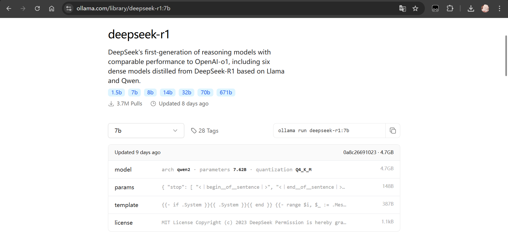

# 本地模型接入教程

因 Ollama 兼容 Openai API，本插件也支持接入通过 Ollama 部署的本地模型

## 安装 Ollama

进入 [Ollama 官方网站](https://ollama.com/)，点击 `Download` 按钮，也可以直接点击下方按钮

[](https://ollama.com/download)

## 运行本地模型

在 [Ollama Library](https://ollama.com/library/deepseek-r1) 中选择你需要的模型，复制运行命令

[](https://ollama.com/library/deepseek-r1)

例如：

```bash
ollama run deepseek-r1:7b
```

## 修改插件配置

接入本地模型，需要配置

- `deepseek__base_url`
- `deepseek__api_key`
- `deepseek__enable_models`

配置示例

```bash
deepseek__api_key = "sk-xxx"
deepseek__enable_models='
[
  { "name": "deepseek-chat" },
  { "name": "deepseek-reasoner" },
  {
    "name": "deepseek-r1:7b",
    "base_url": "http://localhost:11434/v1"
  }
]
'
```

## 使用模型

### 单次使用

```bash
/deepseek [内容] --use-model deepseek-r1:7b
```

### 设为默认

```bash
/deepseek model --set-default deepseek-r1:7b
```

快捷指令：`/设置默认模型  deepseek-r1:7b`
